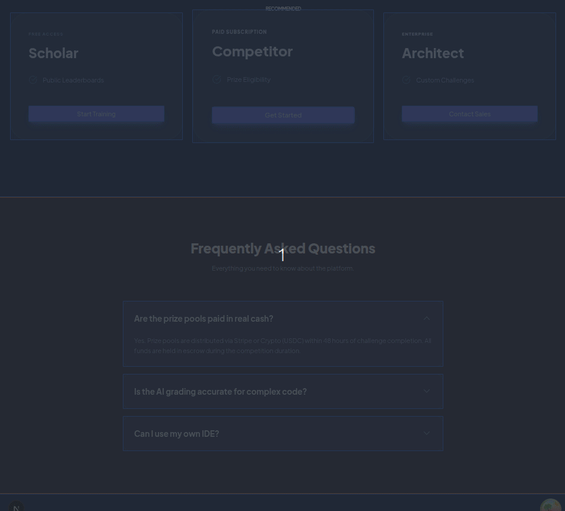

# Nextray

> Visualize Server and Client Component boundaries in your Next.js App Router directly in the browser.


---

## The Problem

With the Next.js App Router, there is no built-in visual map for server vs client boundaries on the live page. Developers often trace `"use client"` manually across files.

Nextray makes those boundaries visible instantly.

<!-- 👇 HERO GIF — place your Peek recording here. Shows the tool in action before anything else. -->


---

## What It Does

Nextray draws a live overlay on your page that shows exactly where your server/client boundaries are — no source diving, no guessing.

| Visual | Meaning |
|--------|---------|
| 🔵 Blue border + tint | Server Component |
| 🟠 Orange border + tint | Client Component |
| ⚡ Boundary indicator | First server → client transition |
| 🏷️ Hover badge | Component name + file path |
| `Ctrl/Cmd + Left Click` | Open file directly in VS Code |

---

## Install

Add it as a dev dependency:

```tsx
npm i -D @saadeh/nextray
```

---

## Setup

### 1) Add plugin to `next.config.mjs`

```js
import { withNextray } from "@saadeh/nextray/plugin";

const nextConfig = {};

export default withNextray(nextConfig);
```

### 2) Mount overlay in `app/layout.tsx`

```tsx
import { NextrayDevOverlay } from "@saadeh/nextray/overlay";

export default function RootLayout({ children }: { children: React.ReactNode }) {
  return (
    <html lang="en">
      <body>
        <NextrayDevOverlay />
        {children}
      </body>
    </html>
  );
}
```

Start your app in development mode and the overlay will appear automatically.

---

## Optional Configuration

```tsx
<NextrayDevOverlay
  options={{
    enableOpenInEditor: true,
    openInEditorModifier: "auto", // "auto" | "ctrl" | "meta"
    editorUriScheme: "vscode://file"
  }}
/>
```

| Option | Type | Default | Description |
|--------|------|---------|-------------|
| `enableOpenInEditor` | `boolean` | `true` | Enables file-open shortcut |
| `openInEditorModifier` | `"auto" \| "ctrl" \| "meta"` | `"auto"` | Modifier key (`auto` detects OS) |
| `editorUriScheme` | `string` | `"vscode://file"` | URI scheme for editor links |

---

## Requirements

- Next.js 14+
- React 18+
- App Router project

---

## Development Scope

- Designed for development/debugging workflows.
- Instrumentation is development-focused.

---

## Collaboration and Issues

Feedback and contributions are welcome.

- Open an Issue for bugs or feature requests.
- Include Next.js version, package version, and clear reproduction steps.
- For Pull Requests, include a clear summary and screenshots/GIFs for UI behavior changes.

---

## License

[MIT](LICENSE) © [Moemen Saadeh](https://github.com/Moemen12)
